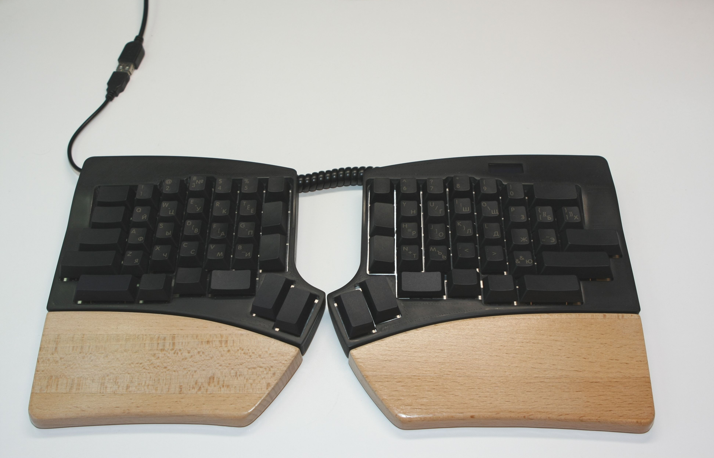
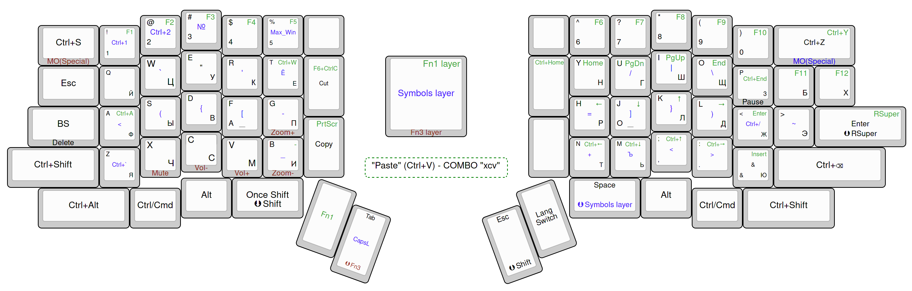
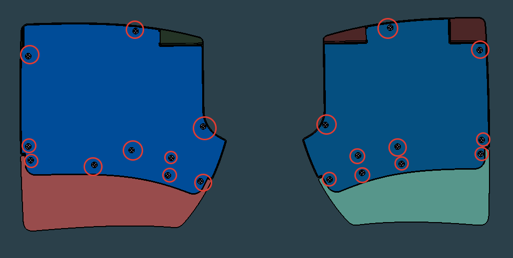
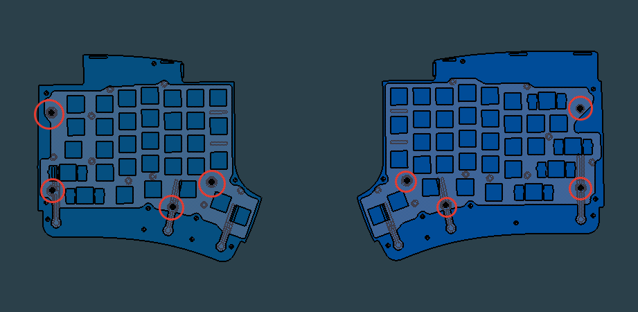

#  JiaEX - split keyboard for extended alphabets.

`assembled-keyboard.stl` - 3d model of assembled keyboard.

## Features

- enough keys for placing on base layer all letters for extended alphabets (alphabets with more than 26 letters).
- plenty of keys for playing with different variants to find your best setup.
- one keyboard for all operating systems. Switch between settings for different operating systems with a shortcut (currently settings for Linux and Windows are implemented).
- used AT90USB1286 with 128 KB memory. No limits for storing settings.
- wide choice of keycaps. The keyboard is designed for maximum use of keycap sets from standard keyboards. 1.75U keys of thumb cluster and 1.5U vertical keys can be replaced with 1.5U or 1.25U keys in any combination.
- wrist pad is rigidly attached to the keyboard. The keyboard is not intended to be used without a wrist pad.
- the display shows current default layout (for example Linux) and current active layer plus Caps Lock state.
- powered by QMK.

## Layout

[keyboard-layout-editor.com](http://www.keyboard-layout-editor.com/#/gists/80bbde035c246cb868fec8fd4ef6ad40)

## Build guide

### Folders

- `case` - stl-files for 3d printing case and wrist pads.  Case and wrist pads are designed by Alexander_St enginemojo@gmail.com.
- `datasheets` - datasheets for some used parts
- `firmware` - source files for QMK firmware
- `pcb` - KiCAD source and gerber files for manufacturing PCB.
- `plate` - dxf for laser cutting metal plate.

### Firmware

- install qmk 
- copy folder `jiaex` from `firmware` to `keyboards` folder of qmk installation
- <u>Until pull request [#11487](https://github.com/qmk/qmk_firmware/pull/11487) is not merged in QMK master you must apply this pull request by yourself.</u>
- run `qmk flash -kb jiaex -km default` 

### PCB and Case

Kicad libraries used:

- https://github.com/XenGi/teensy_library

### Bill of materials

| Name                                          | Value                                                                                                            | Quantity |
| --------------------------------------------- | ---------------------------------------------------------------------------------------------------------------- | -------: |
| Microcontroller board                         | [Teensy ++ 2.0](https://www.pjrc.com/store/teensypp.html)                                                        |        2 |
| SMD Diode                                     | 1N4148 [SOD-123]                                                                                                 |       68 |
| SMD Resistor 1206                             | 30K                                                                                                              |        2 |
| SMD Resistor 1206                             | 3K                                                                                                               |        4 |
| SMD Resistor 1206                             | 10K                                                                                                              |        1 |
| Jack RJ-22                                    | [215875-1, Conn RJ-22 F 4 POS 1.02mm Solder RA Thru-Hole 4 Terminal 1 Port Cat 3 T/R](datasheets/Jack_RJ-22.pdf) |        2 |
| OLED display                                  | [0.91 inch OLED Module 128x32, I2C](datasheets/OLED_Module_User_Manual_EN.pdf)                                   |        1 |
| Plug for OLED display                         | [PLS-4R (DS1022-1x4R)](datasheets/DS1022.pdf)                                                                    |        1 |
| Key switch                                    | Any Cherry MX compatible                                                                                         |       68 |
| Key stabilyzers                               | Any Cherry MX compatible, plate mount                                                                            |        6 |
| 4-wire phone cable with RJ11 (TP-4P4C) jacks. | Max length of cable - 11 cm.                                                                                     |        1 |
| Rubber feet                                   | At your own choice. I use [RF-3004](datasheets/DOC004505728.pdf)                                                 |      --- |
| Metal plate. Thickness                        | 1.5 mm                                                                                                           |        2 |

### Screws

| Name                                                                                                   | Diameter, mm | Length, mm | Image               | Quantity | Notes                                                   |
| ------------------------------------------------------------------------------------------------------ | -----------: | ---------: | ------------------- | -------: | ------------------------------------------------------- |
| Self-tapping screw for plastic, countersunk head, blunt end, Phillips head, full thread, ART 9090      |            3 |      8..10 |  |       20 | Drill the hole with a 2 mm drill before insert screw.   |
| Self-tapping screw DIN 7981 FH (A2) with a blunt end with a half-cylindrical head, head Phillips ST2.2 |          2.2 |     6.5..8 |  |        8 | Drill the hole with a 1.2 mm drill before insert screw. |

## Inspiration

Keyboard is inspired by the following keyboards:

- Jian
- Jiran
- Ultimate Hacking Keyboard
- Ergodox

Layout inspired by ideas of:

- Tonsky https://tonsky.livejournal.com/318571.html (for non-Russian speakers use google translate  in Chrome browser)
- Ultimate Hacking Keyboard
- Optozorax https://github.com/optozorax/moonlander (for non-Russian speakers use google translate in Chrome browser)

 

